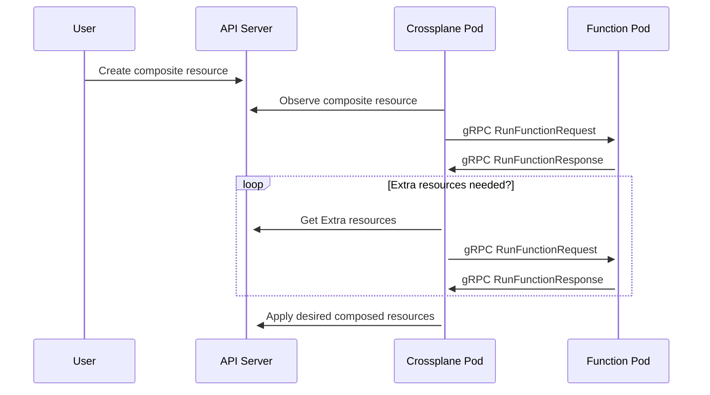

コンポジション関数（略して関数）は、Crossplaneリソースをテンプレート化するカスタムプログラムです。Crossplaneは、コンポジットリソース（XR）を作成するときに、どのリソースを作成すべきかを判断するためにコンポジション関数を呼び出します。GoやPythonのような汎用プログラミング言語を使用してリソースをテンプレート化する関数を書くことができます。汎用プログラミング言語を使用することで、ループや条件分岐など、より高度なロジックを使用してリソースをテンプレート化することができます。

GoやPythonなどの汎用プログラミング言語を使用して関数を構築できます。Crossplaneコミュニティは、[CUE](https://cuelang.org)、Helmのような[Goテンプレート](https://pkg.go.dev/text/template)、または[Patch and Transforms]()を使用してCrossplaneリソースをテンプレート化する関数も構築しています。

## コンポジション関数のインストール

関数をインストールすると、関数ポッドが作成されます。Crossplaneは、このポッドにリクエストを送信して、コンポジットリソースを作成するときにどのリソースを作成するかを尋ねます。

関数ポッドをインストールするには、Functionオブジェクトを使用し、spec.packageの値を関数パッケージの場所に設定します。

例えば、[Function Patch and Transform](https://github.com/crossplane-contrib/function-patch-and-transform)をインストールするには、

```yaml {label="install"}
apiVersion: pkg.crossplane.io/v1beta1
kind: Function
metadata:
  name: function-patch-and-transform
spec:
  package: xpkg.upbound.io/crossplane-contrib/function-patch-and-transform:v0.1.4
```


関数はCrossplaneパッケージです。パッケージについての詳細は、[パッケージのドキュメント]()をお読みください。


デフォルトでは、関数ポッドはCrossplaneと同じネームスペース（`crossplane-system`）にインストールされます。

## コンポジション関数の検証

`kubectl get functions`を使用して関数のステータスを表示します。

インストール中、関数は`INSTALLED`を`True`として、`HEALTHY`を`Unknown`として報告します。

```shell {copy-lines="1"}
kubectl get functions
NAME                              INSTALLED   HEALTHY   PACKAGE                                                                  AGE
function-patch-and-transform      True        Unknown   xpkg.upbound.io/crossplane-contrib/function-patch-and-transform:v0.1.4   10s
```

Functionのインストールが完了し、使用可能になると、`HEALTHY`ステータスは
`True`を報告します。

## コンポジションで関数を使用する

Crossplaneは、コンポジットリソースを作成するときに、どのリソースを作成すべきかを判断するために関数を呼び出します。また、コンポジットリソースを更新または削除するときに、これらのリソースに対してCrossplaneが何をすべきかを関数が指示します。

Crossplaneが関数を呼び出すとき、コンポジットリソースの現在の状態を送信します。また、コンポジットリソースが所有する管理リソースの現在の状態も送信します。

Crossplaneは、コンポジットリソースが変更されたときにどの関数を呼び出すべきかを、コンポジットリソースが使用するコンポジションを見て判断します。


Crossplaneには、ユーザーが混同しがちな4つのコアコンポーネントがあります：

* [Composition]() - リソースを作成する方法を定義するテンプレート。
* [CompositeResourceDefinition]()
  (`XRD`) - カスタムAPI仕様。 
* [Composite Resource]() (`XR`) - CompositeResourceDefinitionで定義されたカスタムAPIを使用して作成されます。 XRsは、Compositionテンプレートを使用して新しい管理リソースを作成します。 
* [Claim]() (`XRC`) - Composite Resourceのようですが、名前空間スコープがあります。 


コンポジション関数を使用するには、Composition 
modeを
Pipelineに設定します。

pipelineを定義します。
各stepは関数を呼び出します。

各stepは、呼び出す関数の
functionRefを使用して
nameを参照します。



モード: パイプラインを使用するコンポジションでは、`resources`フィールドでリソーステンプレートを指定できません。

リソーステンプレートを作成するには、「パッチと変換」機能を使用してください。



一部の関数では、入力を指定することもできます。  
その関数は種類の入力を定義します。

この例では、
[Function Patch and Transform](https://github.com/crossplane-contrib/function-patch-and-transform)を使用しています。  
Function Patch and TransformはCrossplaneリソーステンプレートを実装します。  
入力の種類はResourcesであり、  
[Patch and Transform]()のresourcesを入力として受け入れます。

```yaml {label="single",copy-lines="none"}
apiVersion: apiextensions.crossplane.io/v1
kind: Composition
# Removed for Brevity
spec:
  # Removed for Brevity
  mode: Pipeline
  pipeline:
  - step: patch-and-transform
    functionRef:
      name: function-patch-and-transform
    input:
      apiVersion: pt.fn.crossplane.io/v1beta1
      kind: Resources
      resources:
      - name: storage-bucket
        base:
          apiVersion: s3.aws.upbound.io/v1beta1
          kind: Bucket
          spec:
            forProvider:
              region: "us-east-2"
```


## コンポジションで関数のパイプラインを使用する

Crossplaneは、合成リソースが変更されたときに、複数の関数に何をするかを尋ねることができます。コンポジションに2つ以上のステップのパイプラインがある場合、Crossplaneはそれらすべてを呼び出します。パイプラインに表示される順序で呼び出します。

Crossplaneは、パイプライン内の各関数に前の関数の結果を渡します。これにより、関数の強力な組み合わせが可能になります。この例では、Crossplaneはfunction-cueを呼び出してS3バケットを作成します。次に、Crossplaneはバケットをfunction-auto-readyに渡し、バケットが準備完了になると合成リソースを準備完了としてマークします。

```yaml {label="double",copy-lines="none"}
apiVersion: apiextensions.crossplane.io/v1
kind: Composition
# Removed for Brevity
spec:
  # Removed for Brevity
  mode: Pipeline
  pipeline:
  - step: cue-export-resources
    functionRef:
      name: function-cue
    input:
      apiVersion: cue.fn.crossplane.io/v1beta1
      kind: CUEInput
      name: storage-bucket
      export:
        target: Resources
        value: |
          apiVersion: "s3.aws.upbound.io/v1beta1"
          kind: "Bucket"
          spec:
            forProvider:
              region: "us-east-2"
  - step: automatically-detect-readiness
    functionRef:
      name: function-auto-ready
```

## 関数を使用するコンポジションをテストする

Crossplane CLIを使用して、コンポジション関数を使用する任意のコンポジションの出力をプレビューできます。これを行うためにCrossplaneコントロールプレーンは必要ありません。Crossplane CLIは、関数を実行するためにDocker Engineを使用します。



[Crossplane CLIドキュメント]()を参照して、Crossplane CLIのインストールと使用方法を学んでください。




`crossplane beta render`を実行するには[Docker](https://www.docker.com)が必要です。


出力をローカルでレンダリングするために、コンポジットリソース、コンポジション、およびコンポジション関数を提供します。

```shell
crossplane beta render xr.yaml composition.yaml functions.yaml
```

`crossplane beta render`はリソースをYAML形式でstdoutに出力します。最初にコンポジットリソースが出力され、その後にコンポジション関数が作成したリソースが続きます。

```yaml
---
apiVersion: example.crossplane.io/v1
kind: XBucket
metadata:
  name: example-render
---
apiVersion: s3.aws.upbound.io/v1beta1
kind: Bucket
metadata:
  annotations:
    crossplane.io/composition-resource-name: storage-bucket
  generateName: example-render-
  labels:
    crossplane.io/composite: example-render
  ownerReferences:
  - apiVersion: example.crossplane.io/v1
    blockOwnerDeletion: true
    controller: true
    kind: XBucket
    name: example-render
    uid: ""
spec:
  forProvider:
    region: us-east-2
```



これらのファイルを使用して`crossplane beta render`を実行することで、以下の出力を再現できます。

`xr.yaml`ファイルにはレンダリングするコンポジットリソースが含まれています：

```yaml
apiVersion: example.crossplane.io/v1
kind: XBucket
metadata:
  name: example-render
spec:
  bucketRegion: us-east-2
```

`composition.yaml`ファイルにはコンポジットリソースをレンダリングするために使用するCompositionが含まれています：

```yaml
apiVersion: apiextensions.crossplane.io/v1
kind: Composition
metadata:
  name: example-render
spec:
  compositeTypeRef:
    apiVersion: example.crossplane.io/v1
    kind: XBucket
  mode: Pipeline
  pipeline:
  - step: patch-and-transform
    functionRef:
      name: function-patch-and-transform
    input:
      apiVersion: pt.fn.crossplane.io/v1beta1
      kind: Resources
      resources:
      - name: storage-bucket
        base:
          apiVersion: s3.aws.upbound.io/v1beta1
          kind: Bucket
        patches:
        - type: FromCompositeFieldPath
          fromFieldPath: spec.bucketRegion
          toFieldPath: spec.forProvider.region
```

`functions.yaml`ファイルにはCompositionがパイプラインステップで参照するFunctionsが含まれています：

```yaml
---
apiVersion: pkg.crossplane.io/v1beta1
kind: Function
metadata:
  name: function-patch-and-transform
spec:
  package: xpkg.upbound.io/crossplane-contrib/function-patch-and-transform:v0.1.4
```


Crossplane CLIは関数を実行するためにDocker Engineを使用します。`functions.yaml`にアノテーションを追加することで、Crossplane CLIが関数を実行する方法を変更できます。関数の実行方法を変更するには、`render.crossplane.io/runtime`アノテーションを関数に追加します。

`crossplane beta render`は2つの`render.crossplane.io/runtime`値をサポートしています：

* `Docker`（デフォルト）はDocker Engineに接続します。Dockerを使用して関数ランタイムをプルして実行します。
* `Development`は手動で実行した関数ランタイムに接続します。

Developmentランタイムを使用する場合、Crossplane CLIは関数のpackageを無視します。代わりに、関数がlocalhostのポート9443でリッスンしていることを確認する必要があります。関数はgRPCトランスポートセキュリティなしでリッスンしている必要があります。ほとんどの関数SDKは、トランスポートセキュリティを無効にするために`--insecure`フラグを使用して関数を実行できるようにします。たとえば、`go run . --insecure`を使用してローカルでGo関数を実行できます。

```yaml {label="development"}
apiVersion: pkg.crossplane.io/v1beta1
kind: Function
metadata:
  name: function-patch-and-transform
  annotations:
    render.crossplane.io/runtime: Development
spec:
  package: xpkg.upbound.io/crossplane-contrib/function-patch-and-transform:v0.1.4
```


`Development` ランタイムを使用して、[コンポジション関数を書く](#write-a-composition-function)ことで、関数をエンドツーエンドでテストしてください。


`crossplane beta render` は、以下の関数アノテーションもサポートしています。これらのアノテーションは、関数の実行方法に影響を与えます：

* `render.crossplane.io/runtime-docker-cleanup` - `Docker` ランタイムを使用する際、このアノテーションは CLI が関数を呼び出した後に関数コンテナを停止すべきかどうかを指定します。`Stop` はコンテナを停止し、`Orphan` はコンテナを実行し続けることをサポートします。
* `render.crossplane.io/runtime-docker-pull-policy` - `Docker` ランタイムを使用する際、このアノテーションは CLI が関数のパッケージをいつプルすべきかを指定します。`Always`、`Never`、および `IfNotPresent` の値をサポートします。
* `render.crossplane.io/runtime-development-target` - `Development` ランタイムを使用する際、このアノテーションは CLI に指定されたターゲットで実行されている関数に接続するよう指示します。これは [gRPC ターゲット構文](https://github.com/grpc/grpc/blob/v1.59.1/doc/naming.md) を使用します。

## コンポジション関数を書く

コンポジション関数を使用すると、選択したプログラミング言語で書かれたコードで複雑なコンポジションを置き換えることができます。Crossplane には、関数を書くためのツール、ソフトウェア開発キット (SDK)、およびテンプレートがあります。

<!-- vale write-good.Passive = NO -->
小さな「こんにちは、世界」関数の例を示します。この例は [Go](https://go.dev) で書かれています。
<!-- vale write-good.Passive = YES -->

```go
func (f *Function) RunFunction(_ context.Context, req *fnv1beta1.RunFunctionRequest) (*fnv1beta1.RunFunctionResponse, error) {
        rsp := response.To(req, response.DefaultTTL)
        response.Normal(rsp, "Hello world!")
        return rsp, nil
}
```

一部の人々は、あらゆる種類の複合リソースと一緒に使用できるようにコンポジション関数を設計しています。
[Function Patch and Transform](https://github.com/crossplane-contrib/function-patch-and-transform) と
[Function Auto Ready](https://github.com/crossplane-contrib/function-auto-ready) は、あらゆる種類の複合リソースで機能します。

もう一つの一般的なパターンは、特定の種類の複合リソースに特化したコンポジション関数を書くことです。この関数には、複合リソースを作成する際に Crossplane にどのリソースを作成するかを伝えるために必要なすべてのロジックが含まれています。このようなコンポジション関数を書くと、コンポジションは小さくなります。それは、複合リソースを作成、更新、または削除する際にどの関数を実行するかを Crossplane に伝えるだけです。

このコンポジションは、Crossplaneに対して、function-xr-xbucketを呼び出すよう指示します。これは、XBucketコンポジットリソースを作成、更新、または削除するたびに行われます。`function-xr-xbucket`は、`XBucket`コンポジットリソースを処理するようにハードコーディングされています。

```yaml {label="dedicated"}
apiVersion: apiextensions.crossplane.io/v1
kind: Composition
metadata:
  name: example-bucket-function
spec:
  compositeTypeRef:
    apiVersion: example.crossplane.io/v1
    kind: XBucket
  mode: Pipeline
  pipeline:
  - step: handle-xbucket-xr
    functionRef:
      name: function-xr-xbucket
```

コンポジション関数を書くには、次の手順を実行します。

1. テンプレートから関数を作成します。
1. テンプレートを編集して関数のロジックを追加します。
1. [関数をテストします](#test-a-composition-that-uses-functions)。
1. 関数をビルドし、パッケージレジストリにプッシュします。

[Crossplane CLI]()を使用して、関数を作成、テスト、ビルド、プッシュします。例えば、

```shell {copy-lines=none}
# Create the function from a template.
crossplane beta xpkg init function-example function-template-go
Initialized package "function-example" in directory "/home/negz/control/negz/function-example" from https://github.com/crossplane/function-template-go/tree/91a1a5eed21964ff98966d72cc6db6f089ad63f4 (main)

$ ls
Dockerfile  fn.go  fn_test.go  go.mod  go.sum  input  LICENSE  main.go  package  README.md  renovate.json

# Edit the template to add your function's logic
$ vim fn.go

# Build the function.
$ docker build . --quiet --tag runtime
sha256:2c31b0f7a34b34ba5b0b2dacc94c360d18aca1b99f56ca4f40a1f26535a7c1c4

# Package the function.
$ crossplane xpkg build -f package --embed-runtime-image=runtime

# Test the function.
$ go run . --insecure
$ crossplane beta render xr.yaml composition.yaml functions.yaml

# Push the function package to xpkg.upbound.io.
$ crossplane xpkg push -f package/*.xpkg crossplane-contrib/function-example:v0.1.0
```


Crossplaneには、コンポジション関数を書くための
[言語別ガイド]()があります。お好みの言語のガイドを参照して、関数を書くための詳細なガイドを確認してください。


コンポジション関数を書く際には、コンポジション関数がどのように機能するかを知っておくと便利です。次のセクションを読んで、
[コンポジション関数の動作](#how-composition-functions-work)について学びましょう。

## コンポジション関数の動作

各コンポジション関数は実際には[gRPC](https://grpc.io)サーバーです。gRPCは、高性能でオープンソースのリモートプロシージャコール（RPC）フレームワークです。関数を[インストール](#install-a-composition-function)すると、Crossplaneはその関数をgRPCサーバーとしてデプロイします。Crossplaneは、すべてのgRPC通信を暗号化し、認証します。

関数を書くためにgRPCの専門家である必要はありません。Crossplaneの関数SDKがgRPCを設定します。ただし、Crossplaneがどのようにあなたの関数を呼び出すか、そしてあなたの関数がどのように応答すべきかを理解することは便利です。



コンポジション関数を使用するコンポジットリソースを作成、更新、または削除すると、Crossplaneはコンポジションのパイプラインに表示される順序で各関数を呼び出します。Crossplaneは、gRPC RunFunctionRequestを送信して各関数を呼び出します。関数は、gRPC RunFunctionResponseで応答する必要があります。


RunFunctionRequest と RunFunctionResponse の詳細なスキーマは、[Buf Schema Registry](https://buf.build/crossplane/crossplane/docs/main:apiextensions.fn.proto.v1beta1) で確認できます。


Crossplane が関数を初めて呼び出すとき、RunFunctionRequest に含まれる重要な情報は4つです。

1. 合成リソースの __観測状態__ と、すべての構成リソース。
1. 合成リソースの __望ましい状態__ と、すべての構成リソース。
1. 関数の __入力__。
1. 関数パイプラインの __コンテキスト__。

関数の主な仕事は、__望ましい状態__ を更新し、それを Crossplane に返すことです。これは RunFunctionResponse を返すことで行います。

ほとんどの合成関数は合成リソースの観測状態を読み取り、それを使用して望ましい状態に構成リソースを追加します。これにより、Crossplane にどの構成リソースを作成または更新すべきかを指示します。

関数が望ましい状態を決定するために __追加リソース__ が必要な場合、Crossplane がすでにアクセスできる任意のクラスター範囲のリソースを、返された RunFunctionResponse を通じて名前またはラベルで要求できます。次に、Crossplane は要求された __追加リソース__ と、関数自体から返された __コンテキスト__ を含めて関数を再度呼び出します。同時に、前回の RunFunctionRequest の __入力__、__観測状態__ および __望ましい状態__ も含まれます。関数は必要に応じて __追加リソース__ を反復的に要求できますが、無限ループを避けるために Crossplane は反復回数を5回に制限します。__追加リソース__ の要求が安定すると、Crossplane は関数が満足したと見なします。そのため、関数は同じリクエストを2回連続で返します。5回の反復後に安定性が達成されない場合、Crossplane はエラーを返します。


<!-- vale write-good.Weasel = NO -->
<!-- Disable Weasel to say "usually", which is correct in this context. -->
_構成された_ リソースは、合成リソースによって作成されたリソースです。構成リソースは通常、Crossplane 管理リソース (MR) ですが、任意の種類の Crossplane リソースである可能性があります。たとえば、合成リソースは ProviderConfig や別の種類の合成リソースを作成することもできます。
<!-- vale write-good.Weasel = YES -->


### 観測された状態

このような複合リソースを作成すると、Crossplaneはそれを _観測_ し、観測された状態の一部として合成関数に送信します。

```yaml
apiVersion: example.crossplane.io/v1
kind: XBucket
metadata:
  name: example-render
spec:
  bucketRegion: us-east-2
```

もし既に構成されたリソースが存在する場合、Crossplaneはそれらを観測し、観測された状態の一部としてあなたの関数に送信します。

Crossplaneはまた、あなたの複合リソースと任意の構成されたリソースの接続詳細を観測します。それらを観測された状態の一部としてあなたの関数に送信します。

Crossplaneは、パイプライン内の関数を呼び出し始める直前に、複合リソースと任意の構成されたリソースを一度だけ観測します。これは、Crossplaneがパイプライン内のすべての関数に同じ観測状態を送信することを意味します。

### 望ましい状態

望ましい状態は、関数パイプラインが複合リソースと任意の構成されたリソースに対して行いたい変更のセットです。関数が望ましい状態に構成されたリソースを追加すると、Crossplaneはそれらを作成します。

関数は次のことを変更できます：

* 複合リソースの `status`。
* 任意の構成されたリソースの `metadata` と `spec`。

関数はまた、複合リソースの接続詳細と準備状況を変更することもできます。関数は、構成されたリソースが準備できているかどうかをCrossplaneに伝えることで、複合リソースが準備できていることを示します。関数パイプラインがすべての構成されたリソースが準備できているとCrossplaneに伝えると、Crossplaneは複合リソースを準備完了としてマークします。

関数は次のことを変更できません：

* 複合リソースの `metadata` または `spec`。
* 任意の構成されたリソースの `status`。
* 任意の構成されたリソースの接続詳細。

関数のパイプラインは望ましい状態を _蓄積_ します。これは、各関数がパイプライン内の前の関数の望ましい状態に基づいて構築されることを意味します。Crossplaneは、パイプライン内のすべての前の関数によって蓄積された望ましい状態を関数に送信します。関数は望ましい状態に追加または更新を行い、その後それを渡します。パイプライン内の最後の関数が実行されると、Crossplaneはそれが返す望ましい状態を適用します。


関数は __必ず__ RunFunctionRequest から RunFunctionResponse にすべての望ましい状態をコピーしなければなりません。関数が望ましい状態にリソースを追加した場合、次の関数はそれを望ましい状態にコピーしなければなりません。そうしないと、Crossplaneはリソースを適用しません。リソースが存在する場合、Crossplaneはそれを削除します。

関数は、意図的に望ましい状態の一部をコピーしないことを選択できます。
たとえば、関数はリソースが存在しないようにするために、望ましいリソースをコピーしないことを選択する場合があります。

ほとんどの関数SDKは、望ましい状態のコピーを自動的に処理します。


関数は、関心のあるフィールドのみを望ましい状態に追加する必要があります。
Crossplaneが関数を呼び出すたびに、これらのフィールドを追加する必要があります。関数が望ましい状態にフィールドを一度追加したが、次回呼び出されたときに追加しなかった場合、Crossplaneはそのフィールドを削除します。合成リソースについても同様です。関数が望ましい状態に合成リソースを追加したが、次回呼び出されたときに追加しなかった場合、Crossplaneは合成リソースを削除します。


Crossplaneは
[サーバーサイドアプライ](https://kubernetes.io/docs/reference/using-api/server-side-apply/)
を使用して、関数パイプラインから返された望ましい状態を適用します。サーバーサイドアプライの用語では、望ましい状態は_完全に指定された意図_です。


たとえば、関数が`us-east-2`リージョンにS3バケットが存在することを確認したいだけの場合、このリソースを望ましい合成リソースに追加する必要があります。

```yaml
apiVersion: s3.aws.upbound.io/v1beta1
kind: Bucket
spec:
  forProvider:
    region: us-east-2
```

バケットがすでに存在し、他の`spec`フィールドや`status`、`name`、`labels`などがある場合でも、関数はそれらを省略する必要があります。関数は、自分が意見を持っているフィールドのみを含めるべきです。Crossplaneは、関数が関心を持っているフィールドを適用し、既存のバケットとマージすることを担当します。


合成関数は、実際には望ましいリソースと観測されたリソースにYAMLを使用しません。この例は説明の目的でYAMLを使用しています。


### 関数入力

Compositionにinputが含まれている場合、Crossplaneはそれを関数に送信します。入力は、関数に追加の設定を提供する便利な方法です。入力をサポートすることは任意です。すべての関数が入力をサポートしているわけではありません。

```yaml {label="input",copy-lines="none"}
apiVersion: apiextensions.crossplane.io/v1
kind: Composition
metadata:
  name: example-render
spec:
  compositeTypeRef:
    apiVersion: example.crossplane.io/v1
    kind: XBucket
  mode: Pipeline
  pipeline:
  - step: patch-and-transform
    functionRef:
      name: function-patch-and-transform
    input:
      apiVersion: pt.fn.crossplane.io/v1beta1
      kind: Resources
      resources:
      - name: storage-bucket
        base:
          apiVersion: s3.aws.upbound.io/v1beta1
          kind: Bucket
        patches:
        - type: FromCompositeFieldPath
          fromFieldPath: spec.bucketRegion
          toFieldPath: spec.forProvider.region
```


Crossplaneは関数の入力を検証しません。関数が自分の入力を検証することは良いアイデアです。


### ファンクションパイプラインコンテキスト

時々、パイプライン内の二つの関数は、望ましい状態ではない情報を互いに共有したいと考えます。関数はこれにコンテキストを使用できます。任意の関数がパイプラインコンテキストに書き込むことができます。Crossplaneはコンテキストをすべての後続の関数に渡します。Crossplaneがすべての関数を呼び出した後、パイプラインコンテキストは破棄されます。

Crossplaneもコンテキストに書き込むことができます。アルファの[コンポジション環境]()機能を有効にすると、Crossplaneは環境をトップレベルのコンテキストフィールド`apiextensions.crossplane.io/environment`に書き込みます。

## コンポジション関数を無効にする

Crossplaneはデフォルトでコンポジション関数を有効にします。`helm install --args`を使用して、Crossplaneでベータ機能フラグを無効にすることで、コンポジション関数のサポートを無効にします。

```shell
helm install crossplane --namespace crossplane-system crossplane-stable/crossplane \
    --create-namespace \
    --set "args='{--enable-composition-functions=false}'"
```

前述のHelmコマンドは、コンポジション関数機能フラグを無効にしてCrossplaneをインストールします。ログ行を探して、コンポジション関数が無効になっていることを確認してください：

```shell {copy-lines="1"}
 kubectl -n crossplane-system logs -l app=crossplane
{"level":"info","ts":1674535093.36186,"logger":"crossplane","msg":"Beta feature enabled","flag":"EnableBetaCompositionFunctions"}
```

Crossplaneが起動したときにログ行が表示されない場合、コンポジション関数が無効になっています。

## 追加リソースを無効にする

Crossplaneはデフォルトで__追加リソース__を有効にしており、FunctionsがCrossplaneがすでにアクセスできる任意のクラスター範囲のリソースにアクセスできるようにします。コンポジション関数を有効にしたまま、__追加リソース__のサポートを無効にするには、`helm install --args`を使用してCrossplaneでベータ機能フラグを無効にします。

```shell
helm install crossplane --namespace crossplane-system crossplane-stable/crossplane \
    --create-namespace \
    --set "args='{--enable-composition-functions-extra-resources=false}'"
```

前述のHelmコマンドは、追加リソース機能フラグを無効にしてCrossplaneをインストールします。コンポジション関数が無効になっていることを確認するために、ログ行を探してください：

```shell {copy-lines="1"}
 kubectl -n crossplane-system logs -l app=crossplane
{"level":"info","ts":1674535093.36186,"logger":"crossplane","msg":"Beta feature enabled","flag":"EnableBetaCompositionFunctionsExtraResources"}
```

Crossplaneが起動したときに出力されるログ行が見えない場合、__追加リソース__がコンポジション関数のために無効になっていることを意味します。これは、関数による__追加リソース__の要求が無視されることを意味します。
