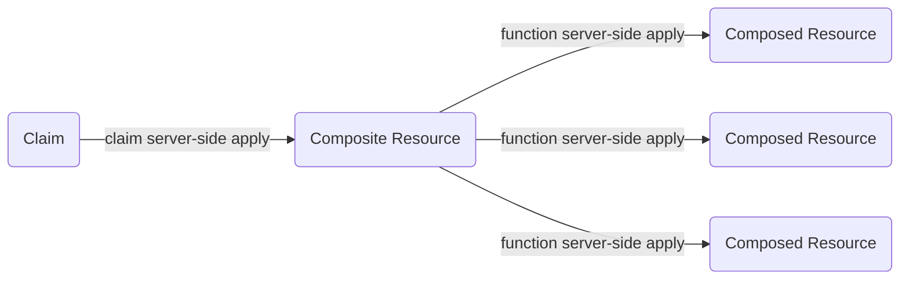

Crossplaneは、サーバーサイドアプライを使用して、クレームを複合リソース（XR）と同期させたり、複合リソースを構成リソースと同期させたりできます。

Crossplaneがサーバーサイドアプライを使用すると、Kubernetes APIサーバーがリソースの同期を支援します。サーバーサイドアプライを使用することで、同期がより予測可能でバグが少なくなります。


サーバーサイドアプライはKubernetesの機能です。サーバーサイドアプライの詳細については、[Kubernetesのドキュメント](https://kubernetes.io/docs/reference/using-api/server-side-apply/)をお読みください。


## サーバーサイドアプライを使用してクレームを複合リソースと同期させる

クレームを作成すると、Crossplaneは対応する複合リソースを作成します。Crossplaneは、クレームを複合リソースと同期させます。クレームを変更すると、Crossplaneはその変更を複合リソースに反映します。

クレームと複合リソースの関係について詳しくは、[クレームのドキュメント]()をお読みください。

Crossplaneは、サーバーサイドアプライを使用して、クレームを複合リソースと同期させることができます。

`--enable-ssa-claims`フィーチャーフラグを使用して、サーバーサイドアプライの使用を有効にします。フィーチャーフラグについては、[Crossplaneのインストールドキュメント]()をお読みください。

クレームの`spec`からフィールドを削除した後に再び表示される場合は、サーバーサイドアプライを有効にして問題を修正してください。サーバーサイドアプライを有効にすると、クレームから削除したときにCrossplaneが複合リソースからラベルや注釈を削除しない問題も修正されます。


サーバーサイドアプライを有効にすると、Crossplaneはクレームとその対応する複合リソースの同期方法に対してより厳格になります：

- クレームの`metadata`は複合リソースの`metadata`と同期します。
- クレームの`spec`は複合リソースの`spec`と同期します。
- 複合リソースの`status`はクレームの`status`と同期します。

サーバーサイドアプライを有効にすると、Crossplaneは複合リソースの`metadata`と`spec`をクレームの`metadata`と`spec`に戻して同期しません。また、クレームの`status`を複合リソースの`status`に同期することもありません。


## サーバーサイドアプライを使用してクレームをエンドツーエンドで同期する

サーバーサイドアプライの完全な利点を得るには、`--enable-ssa-claims`
フィーチャーフラグをコンポジション関数と一緒に使用してください。

コンポジション関数を使用すると、Crossplaneはサーバーサイドアプライを使用して
合成リソースを構成されたリソースと同期します。これについての詳細は
[コンポジション関数のドキュメント]()をお読みください。

サーバーサイドアプライをエンドツーエンドで使用すると、クレームから構成されたリソース、
そしてその逆へのフィールドの明確で予測可能な伝播があります：

* `metadata` と `spec` は、クレームからXR、そして構成されたリソースへと前方に流れます。
* `status` は、構成されたリソースからXR、そしてクレームへと後方に流れます。


コンポジション関数を使用すると、Crossplaneは合成リソース（XR）と構成されたリソースの同期方法に対してより厳格になります：

- XRの `metadata` は構成されたリソースの `metadata` に同期されます。
- XRの `spec` は構成されたリソースの `spec` に同期されます。
- 構成されたリソースの `status` はXRの `status` に同期されます。

コンポジション関数を使用すると、Crossplaneは構成されたリソースの `metadata`
および `spec` をXRの `metadata` および `spec` に戻して同期しません。


Crossplaneがサーバーサイドアプライをエンドツーエンドで使用してクレームを構成された
リソースと同期するとき、クレームの `spec` からフィールドを削除すると、構成されたリソースの
`spec` からもフィールドが削除されます。

Crossplaneがサーバーサイドアプライをエンドツーエンドで使用すると、クレームの
フィールドを複雑な構成されたリソースのフィールドにマージすることもできます。
オブジェクトやオブジェクトの配列は、複雑な構成されたリソースのフィールドの例です。


Crossplaneは、サーバーサイドアプライマージ戦略OpenAPI拡張を使用するリソースの
複雑なフィールドのみをマージできます。これらの拡張についてはKubernetesの
[サーバーサイドアプライのドキュメント](https://kubernetes.io/docs/reference/using-api/server-side-apply/#merge-strategy)をお読みください。

Crossplaneが管理リソースのフィールドをマージしていない場合は、関連するプロバイダーに
問題を提起してください。プロバイダーのメンテナーに、管理リソースにサーバーサイドアプライ
マージ戦略拡張を追加するよう依頼してください。

